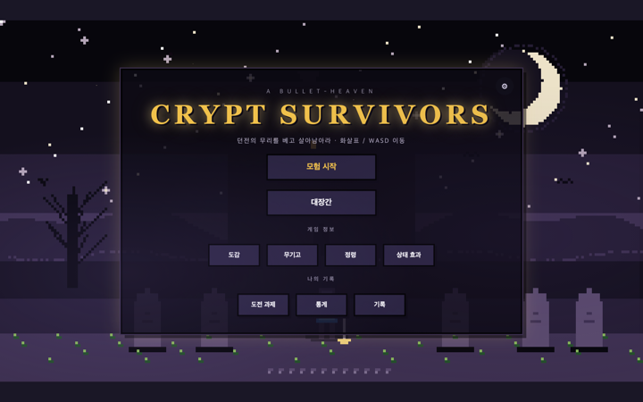

# Crypt Survivors

> **About (EN)** — A Vampire Survivors-style bullet-heaven roguelite in plain
> JavaScript, PixiJS v8 and Vite. Move to kite the swarm; weapons fire on their
> own; level up to pick weapons, passives and orbiting spirits; evolve a maxed
> weapon; survive the rising difficulty — then spend gold in a global forge and
> run it back. The simulation never imports PixiJS, so the whole game runs
> headless in Node for balance tuning.

뱀파이어 서바이버즈풍 불릿헤븐 로그라이트. 순수 JavaScript(Node ≥18, 트랜스파일 없음) + PixiJS v8 + Vite.

움직여서 몰려오는 적을 유인하고, 무기는 알아서 발사되고, 적을 잡아 XP를 모아
레벨업할 때마다 무기·패시브·정령을 고른다. 무기를 만렙으로 올리면 진화하고,
점점 거세지는 난이도를 버틴 뒤에는 벌어온 골드를 대장간(영구 강화)에 쓴다.

> 형제 프로젝트: `../dragon-game` (던전크래프트 — 드퀘풍 턴제 JRPG).
> 히어로/에셋을 공유하지만 아키텍처는 완전히 다르다.

## 스크린샷



## 실행

```bash
npm install
npm run dev      # 개발 서버 http://localhost:7153/ (포트 사용 중이면 Vite가 자동 증가)
npm test         # Vitest 유닛 테스트 282개 (커밋 전 필수)
npm run build    # 프로덕션 번들 → dist/
node scripts/balance.js [N]   # 헤드리스 밸런스 하네스
```

조작: **방향키 / WASD**로 이동, **스페이스바**로 캐릭터 시그니처(궁극기).
무기는 자동 공격이다.

### 밸런스 하네스

`node scripts/balance.js [N]` — N개 시드(기본 5) × 10분 카이팅 AI를 시뮬레이션한다.
시드 기반이라 **결정적**이고, 생존/4분 내 사망/중앙값/런당 골드 분포를 출력한다.
신뢰할 만한 수치를 보려면 24시드 이상 돌린다.

## 프로젝트 구조

```
src/
  engine/     loop (FIXED_DT 1/60) · world (엔티티 풀) · collision (균일 격자 공간해시, 셀 48)
              renderer (유일한 PixiJS 소비자) · events (히트 이벤트 버스)
  systems/    틱 단위 무상태 시뮬 — movement · spawn (난이도 디렉터 + 웨이브 + 미니보스)
              weaponFire · collision · damage · pickup · status
              spirits (공전 정령) · minions (소환 무기) · skills (레벨업 해금)
              active (스페이스바 시그니처) · enemyAbilities (보스 키트 + 텔레그래프)
              weaponSkyDropFx (무기별 낙하 AoE 연출)
  content/    순수 데이터 — weapons · passives · evolutions · metaUpgrades · characters
              bestiary · drops · loot · achievements · arcanas · spirits · rooms · maps
              status · signatures
  ui/         HTML/CSS 오버레이 — title · charselect · mapselect · arcanaselect · hud
              levelup · evolution · result · shop · gacha · pausemenu · settings
              toast · achievements · arsenal · bestiary · status · stats · spirits · history
  util/       rng (시드) · audio (ZzFX 래퍼 + BGM 엔진) · spriteAngles
              heroAssets / enemyAssets / weaponAssets / sigAssets / buffAssets
              structureAssets / tilesets (바이옴별 Wang 타일셋)
  data/       save.js (localStorage, 방어적 검증) · settings.js
  assets/art/ 스프라이트 ASCII 팩 — palette, atlas 빌더, sprites.js,
              *_hd / *_hd2 / *_xhd / *_hd3 / smooth_walk 변형, hd_promote.js (마지막 로드)

main.js         부트스트랩 + 상태 기계 (title / mapselect / charselect / arcanaselect /
                playing / levelup / legendary / paused / shop / gameover)
loadout.js      런별 무기·패시브·정령·메타·아르카나 + 파생 보정치 (recompute가 전부 접는다)
progression.js  구간별 이차 XP 곡선 (softCap 10)
choices.js      레벨업 굴림 + 적용 (비복원 가중 샘플링)
achievements.js recordRun + checkAchievements (런 중 + 런 종료)
meta.js         대장간 강화 적용 (COST_SCALE 인플레 포함)
scripts/balance.js  헤드리스 밸런스 하네스
```

콘텐츠(무기·패시브·적·진화·상점 강화)는 전부 데이터다. 추가는 엔진 코드가 아니라
`content/` 편집으로 끝난다 — 확장 절차 체크리스트는 [CLAUDE.md](CLAUDE.md)에 있다.

## 핵심 설계

자세한 내용은 **[docs/ARCHITECTURE.md](docs/ARCHITECTURE.md)** 참조. 요약하면:

1. **시뮬 / 렌더 완전 분리** — 시뮬은 순수 데이터 + 순수 함수이고 PixiJS를 import하지 않는다.
   렌더러가 유일한 Pixi 소비자다. 그래서 게임 전체가 Node에서 헤드리스로 돌아간다.
2. **에셋 HD 승격** — 기본 스프라이트 키를 HD 변형으로 재별칭하는 `hd_promote.js`가
   **가장 마지막에** 로드된다. 렌더러도 콘텐츠도 HD 키를 직접 참조하지 않는다.
3. **자족적 월드 엔티티** — 정령/미니언은 `world.entities`에 들어가 렌더러와 공간해시에는
   보이지만 다른 시스템에는 불활성이다. 로드아웃 상태를 읽지도 쓰지도 않는다.
4. **데이터 주도 적 행동** — bestiary 행의 `ability` / `movePattern` 필드를 spawn.js가
   엔티티에 복사한다. 적마다 시스템 코드를 새로 쓰지 않는다.
5. **텔레그래프 창** — 보스/원거리 적은 쿨다운이 끝나도 즉시 쏘지 않고 캐스트를 큐에 넣고
   경고 링을 띄운다. 그동안 movement.js가 그 자리에 고정한다.
6. **방어적 세이브 마이그레이션** — 옛 세이브가 크래시하지 않는다.

## 상태

플레이 가능한 완성 상태다. 타이틀 → 맵/캐릭터/아르카나 선택 → 런 루프 →
레벨업 선택 → 무기 진화 → 난이도 디렉터 → 결과 화면 → 대장간(영구 강화) 순환이 전부 붙어 있다.

- 히어로 7명 전원 스페이스바 시그니처 보유 (메테오/성광/대지균열/화살비/전기장/단검투척 등)
- PixelLab로 만든 픽셀 아트 파이프라인 — 히어로 4방향 idle/walk/attack, 적/보스,
  투사체 애니메이션, 바이옴별 Wang 타일셋, 버프 오라 헤일로, 구조물 프롭
- 대장간 = **전역** 강화 (VS PowerUps 모델, 4카테고리 · 캐릭터별 강화는 없음)
- 헬 모드(NG+), 아르카나, 업적, 도감(bestiary/arsenal), 가챠, 런 히스토리
- 유닛 테스트 282개

설계는 gstack `/office-hours` → `/plan-eng-review` → `/plan-design-review` 순으로 잡았다.

## 문서

| 문서 | 내용 |
|---|---|
| [docs/ARCHITECTURE.md](docs/ARCHITECTURE.md) | 아키텍처 상세 |
| [CLAUDE.md](CLAUDE.md) | 작업 규칙 + 콘텐츠 확장 체크리스트 + 알려진 함정 (899줄) |

## 라이선스

**Source-available — 오픈소스가 아닙니다.** 코드를 읽을 수 있게 공개했을 뿐,
사용 권한을 준 것은 아닙니다. 다른 프로젝트에 가져다 쓰거나 재배포·상업적 이용을
하려면 사전 서면 허락이 필요합니다. 전문은 [LICENSE](LICENSE), 한국어 안내는 [LICENSE.ko.md](LICENSE.ko.md) 참조.

효과음은 [ZzFX](https://github.com/KilledByAPixel/ZzFX)(MIT), 픽셀 아트는 PixelLab으로
생성했다. 서드파티 구성요소는 각자의 라이선스를 따른다.
