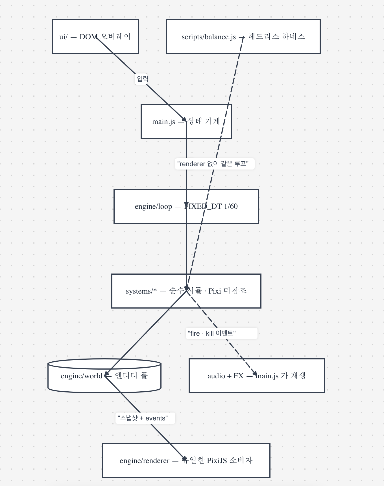

# Crypt Survivors — 아키텍처

> 이 문서는 "왜 이렇게 나뉘어 있는가"를 설명해요.
> 콘텐츠 추가 절차와 함정 목록은 [`../CLAUDE.md`](../CLAUDE.md)에 있어요.

---

## 0. 한 줄 요약

**시뮬레이션은 PixiJS를 몰라요.** 렌더러가 유일한 Pixi 소비자이고, 나머지는
전부 순수 데이터 + 틱 단위 순수 함수예요. 그래서 `scripts/balance.js`가
브라우저 없이 게임 전체를 10분치씩 수백 판 돌려 난이도 곡선을 재요.

```
    ┌─────────────┐   입력    ┌──────────────────────────────────┐
    │  ui/ (DOM)  │──────────▶│ main.js  상태 기계 + 배선          │
    └─────────────┘           └───────┬──────────────────────────┘
                                      │ 매 틱
                                      ▼
    ┌──────────────────────────────────────────────────────────┐
    │ engine/loop  (FIXED_DT = 1/60)                           │
    │   → systems/*  movement · spawn · weaponFire · collision │
    │                damage · pickup · status · spirits …      │  ← 순수. Pixi 미참조.
    │   → engine/world  (엔티티 풀)                             │
    │   → engine/collision  (균일 격자 공간해시, 셀 48)          │
    └───────────────────────┬──────────────────────────────────┘
                            │ world 스냅샷 + events
                            ▼
                  ┌──────────────────────┐
                  │ engine/renderer.js   │  ← 유일한 PixiJS 소비자
                  └──────────────────────┘
```

`scripts/balance.js`는 이 그림에서 **renderer와 ui만 빼고** 같은 루프를 돌려요.

같은 구조를 이벤트 플로우로 펼치면 이래요 — 시뮬이 내보내는 `events`가
렌더러와 오디오로 갈라지는 지점이 핵심이에요:



> 이 다이어그램은 [pig-ma](https://github.com/gook-lab/pig-ma)의 Mermaid
> import로 그렸어요. 원본 정의는
> [`diagrams/event-flow.mmd`](diagrams/event-flow.mmd) — 구조가 바뀌면
> 이 파일을 다시 import 해서 갱신해요.

---

## 1. 고정 타임스텝 루프

`engine/loop.js`가 `FIXED_DT = 1/60`으로 시뮬을 돌려요. 프레임 시간이 튀어도
시뮬 결과가 변하지 않으므로, 시드가 같으면 **밸런스 하네스의 결과가 재현돼요.**

## 2. 엔티티 풀 + 공간해시

- `engine/world.js` — 엔티티를 풀링해서 재사용해요 (수천 마리가 매 초 죽고 태어나요).
- `engine/collision.js` — 균일 격자 공간해시(셀 크기 48)로 브로드페이즈를 잡아요.
  N² 검사를 하지 않으므로 스웜 규모가 커져도 프레임이 유지돼요.
- `engine/events.js` — 히트 이벤트 채널. 시스템이 서로를 직접 호출하지 않고
  이벤트로 알려요.

---

## 3. 에셋 HD 승격 (로드 순서가 중요)

기본 스프라이트 키(`mage_walk`)는 `assets/art/sprites.js`에 정의돼요.
HD 변형은 별도 팩(`heroes_hd.js`, `heroes_smooth_walk.js` …)에 살아요.

**마지막에 import되는 `hd_promote.js`**가 PROMOTE 맵을 보고 기본 키를 최선의
HD 변형으로 재별칭해요. 덕분에 렌더러도 `characters.js`도 `weapons.js`도
**HD 키를 직접 참조하지 않아요.**

> ⚠️ `hd_promote.js`는 반드시 모든 `*_hd*` 팩 **뒤에** import되어야 해요.

기존 키에 HD 아트를 붙이려면: 팩 파일에서 `window.SPRITES['key_xxx']`를 추가하고,
`hd_promote.js`의 PROMOTE에 `key: 'key_xxx'`를 넣어요.
`characters.js` / `weapons.js`의 스프라이트 키는 절대 건드리면 안 돼요. 건드리면 HD 변형 재별칭이 작동하지 않거든요.

---

## 4. 렌더러 측 합성 스프라이트

융합 정령(steam / oberon / frostbolt / verdant)과 주차된 네크로맨서는
새 아트를 만들지 않고 **런타임 캔버스 합성**으로 기존 스프라이트를 재사용해요.
융합 정령은 베이스 + 액센트 2레이어를 `globalCompositeOperation = 'screen'`으로 섞어요.

---

## 5. 자족적 월드 엔티티 (정령 · 미니언)

`systems/spirits.js`와 `systems/minions.js`는 엔티티를 `world.entities`에 넣어요.
렌더러와 공간해시에는 보이지만 **다른 시스템에는 불활성**이에요.

- 정령: 플레이어를 공전하며 쿨다운마다 힐/실드/공격
- 미니언: 가장 가까운 적으로 걸어가 근접 또는 유도 투사체로 공격

둘 다 로드아웃 상태를 읽지도 쓰지도 않아요 — 그래서 추가/삭제가 국소적이에요.

---

## 6. 스프라이트별 회전 오프셋

`util/spriteAngles.js`가 스프라이트 키 → 기준 회전 오프셋을 매핑해요.
렌더러는 `atan2(vy, vx) + spriteBaseAngleFor(name)`을 적용해요.

위를 향해 그려진 화살 스프라이트가 오프셋 없이 수평 이동하면 **누워서 날아가요.**
이 맵은 그 버그를 위해 존재해요. 새 스프라이트가 위를 향한다면
SPRITE_BASE_ANGLES에 `'sprite_key': -Math.PI / 2`를 추가하면 돼요 — **렌더러는 고칠 필요 없어요.**

---

## 7. 플레이어 시그니처 (스페이스바)

`systems/active.js`가 캐릭터별 궁극기를 실행해요. 데이터는 `content/signatures.js`에 있어요.
활성 히어로 7명 전원이 시그니처를 갖고 있어요.

| 히어로 | 시그니처 | kind |
|---|---|---|
| 메이지 | meteor_storm (자동 조준 메테오 5발) | meteor |
| 나이트 | holy_beam (수직 광주 3 + 솔라 플레어) | beam |
| 워리어 | earth_crack (자기중심 AoE + 마그마 분출) | self |
| 헌트리스 | arrow_rain (작은 화살 12발) | arrows |
| 포르타 | tesla_field (전기 기둥 5, 시안 리컬러) | beam |
| 젠나로 | blade_volley (단검비 16발, 황동+크림슨) | arrows |

---

## 8. 적 행동 — 데이터 주도

`bestiary.js` 행의 **세 필드**를 `spawn.js`가 엔티티에 복사해요.
적마다 시스템 코드를 새로 쓰지 않아요.

### `ability` (배열이 아니라 단일 필드)

| 값 | 동작 |
|---|---|
| `summoner` | 텔레그래프 후 `summonType` 소환 (`SUMMON_CAP` 수명) |
| `shielded` | 주기적 `shieldT` 배리어. damage.js의 프리즈 배수 직후 훅에서 90% 흡수 |
| `kamikaze` | 준비 → 돌진 → 파편 링 폭발 + 자폭. 엘리트 전용 원거리 티어 게이트를 의도적으로 우회 |
| `buffer` | 주변 아군에 `e.hasteT` 각인. 감쇠는 movement.js가 소유해 자동 만료 + status `speedMult`와 합성 |

### `movePattern`

`weave`(수직 사인 운동) 등.

> ⚠️ weave 게이트는 `!(e.charging > 0)`이지 `<= 0`이 아니에요.
> `undefined <= 0`은 false여서, `<= 0`으로 쓰면 분기가 **조용히 한 번도 안 돌아요.**

---

## 9. 텔레그래프 창 (보스 · 원거리)

`systems/enemyAbilities.js`가 적에 `telegraph` 필드를 만들어요. 쿨다운이 0이 되면
즉시 발사하지 않고 캐스트를 큐에 넣고(`castQueued`, `castDx/Dy`, `castPhase`)
`telegraph > 0`으로 만들어요.

텔레그래프 중에는 `movement.js`가 그 자리에 얼리고, `renderer.js`의 `drawTelegraphs`가
남은 시간에 비례해 붉은 링을 뛰게 그려요.

새 텔레그래프 능력은 기존 창 패턴(`bosscast` 분기) 안에서 큐에 넣고,
`telegraph <= 0` 블록에서 해소하면 돼요.

---

## 10. 세이브 — 방어적 마이그레이션

`data/save.js`는 방어적으로 검증해요. 옛 세이브가 크래시하지 않아요.
필드를 추가할 때는 기본값과 검증을 함께 넣어야 해요.

---

## 11. 오디오 폴리포니 가드

`util/audio.js`는 동시 보이스를 **16개로 상한**하고, 동일 사운드는 **45ms 최소 간격**으로
스로틀해요. 스웜 게임에서 이 가드가 없으면 소리가 뭉개지고 프레임이 떨어져요.

BGM 엔진(`setMusic('ambient'|'boss'|'off')`)은 사용자 볼륨 설정에 비례한 부드러운
펄스를 인터벌로 스케줄해요. 새 효과음은 `SOUNDS` ZzFX 파라미터 맵에 추가하면 돼요.

---

## 12. 헬 모드 (NG+)

`runEvent.hell`이 런타임 플래그예요. `startRun`이 세이브에서 스냅샷을 떠서
**런 도중 설정을 바꿔도 그 런에는 적용되지 않아요.** spawn.js가 HP ×2, 골드 ×3을 곱해요.

> **슬롯 확장 시 빌드 희석**: 몬스터 스케일링 다이얼(`hpPerMinute` / `hpPerLevel`)은
> 코드상 슬롯 수와 직결되어 있지 않지만 실질적으로는 결합되어 있어요. 슬롯이 늘면
> 빌드가 넓어지고 → 무기당 DPS가 떨어지고 → 약한 빌드가 더 빨리 죽어요.
> 슬롯 수를 바꾼 뒤에는 반드시 `node scripts/balance.js`로 재튜닝해야 해요.
>
> `hpPerLevel`은 `max(1, lvl × hpPerLevel)`이라 저레벨에 묶인 약한 빌드는
> levelScale이 1.00에 머물러요. 따라서 **약빌드 보호의 진짜 레버는 시간 다이얼
> (`hpPerMinute`)**이지 레벨 다이얼이 아니에요.

---

## 13. 메타 진행 — 대장간

영구 강화는 **전역**이에요 (VS PowerUps 모델). 캐릭터별 강화는 없어요.

`content/metaUpgrades.js`가 4카테고리 카탈로그를 갖고 있어요
(⚔️공격 / 🛡️방어 / 💰성장 / 🎲편의):
Might·Amount·Cooldown·Area·Speed·Duration·(크리·관통) /
MaxHealth·Armor·Recovery·MoveSpeed·Revival / Growth·Greed·Luck·Magnet·Curse / Reroll·Skip.

각 강화는 `meta:{key:val}`(meta.js의 `applyMetaUpgrades`가 `loadout.meta[k] × 레벨`로
접어줘요, `COST_SCALE = 1.5`) 또는 `token:`(런 경제)을 가지고 있어요.

스탯을 추가하려면 `meta:{newKey}` + `recompute()` 소비자를 함께 넣으면 돼요. 예:

- **Speed** → `meta.projSpeed` → `loadout.projSpeedMult` → weaponFire.js가
  `def.speed × PROJ_SPEED_SCALE × projSpeedMult`
- **Curse** → `meta.curse` → main.js의 `player.curse` 각인 → spawn.js의
  `hellMul = (hell?2:1) × (1 + player.curse)` (적 HP와 수를 동시에 올린다 — 위험 ↑, 골드/XP ↑)

`ui/shop.js`는 전 카테고리를 **한 페이지**에 그리고 초기화(골드 환불) 버튼을 제공해요.

> 밸런스 하네스에는 메타 강화가 없어요. 그래서 **대장간을 바꿔도 측정된 밸런스는 흔들리지 않아요.**

---

## 14. 런 중 업적 스캔

`checkAchievements(runDelta)`가 `save.stats + runDelta`로 스냅샷을 합성해
새로 충족된 업적을 해금하고 영속화 + 토스트를 띄워요.
현재 레벨업과 보스 처치 시점에 호출돼요.

---

## 15. 콘텐츠는 데이터예요

무기·패시브·적·진화·상점 강화·아르카나·정령·맵은 전부 `content/`의 순수 데이터예요.
추가는 엔진 코드가 아니라 데이터 편집이에요 — 단계별 체크리스트가
[`../CLAUDE.md`](../CLAUDE.md)의 "Content Extension Checklists"에 있어요.
